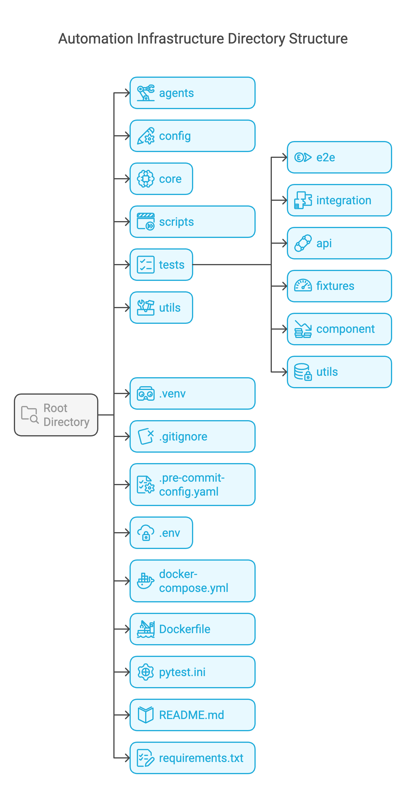

# QA Automation Framework

A scalable test automation framework built with Python and pytest.

## Project Structure


This repository serves as a demonstration of a scalable, maintainable, and extensible end-to-end (E2E) and integration automation infrastructure for testing the [ExpandTesting Practice Site](https://practice.expandtesting.com/). The goal is to establish a robust framework that can handle automation for different testing scenarios effectively.




## Features

- Modular API client with proper error handling
- Type-annotated Python code following PEP 8
- Pytest-based test execution
- Integration and E2E test coverage
- Data generation utilities
- Parallel test execution support


## Setup

1. Install dependencies:
```bash
pip install -r requirements.txt
```

2. Run tests:
```bash
# Run all tests
pytest

# Run with parallelization
pytest -n auto

# Run specific test type
pytest tests/e2e/
pytest tests/integration/
```

## Key Components

- **APIClient**: Core client for making HTTP requests
- **Data Models**: Pydantic models for request/response validation
- **Fixtures**: Reusable test components in conftest.py
- **Utils**: Helper functions for test data generation

## Dependencies

- Python 3.10+
- pytest
- requests
- pydantic
- pytest-xdist (parallel execution)

## Best Practices

- Use type hints consistently
- Follow PEP 8 style guide
- Write descriptive test names
- Use fixtures for test setup
- Clean up test data after execution
- Handle errors appropriately
- Document code with docstrings
